## MongoDB

1. **Установка**: Поставили MongoDb локально на машину(можем себе позволить) и запустили
   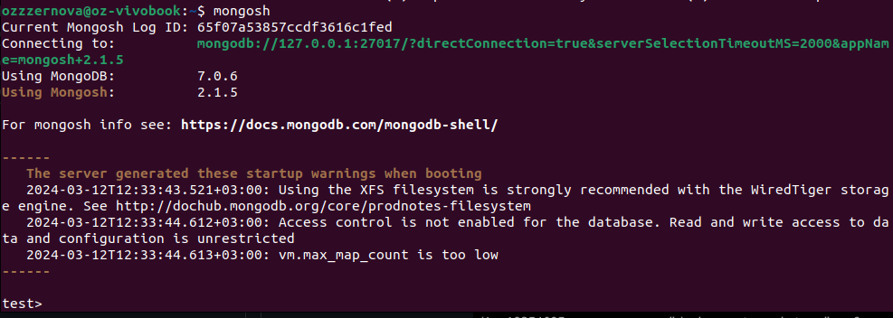
2. **Данные**: Рандом сказал, что будем работать с [Credit Card Fraud Detection](https://www.kaggle.com/datasets/mlg-ulb/creditcardfraud/data). Скачали с Kaggle csv и скормили в mongoimport
   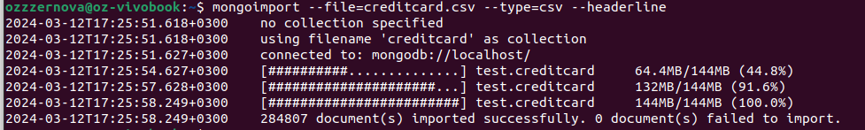
3. Сколько вообще у нас имеется записей в датасете? Определим с помощью countDocuments
   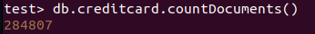
4. Заодно посмотрим, как они выглядят - для этого просто вызовем find без аргументов
   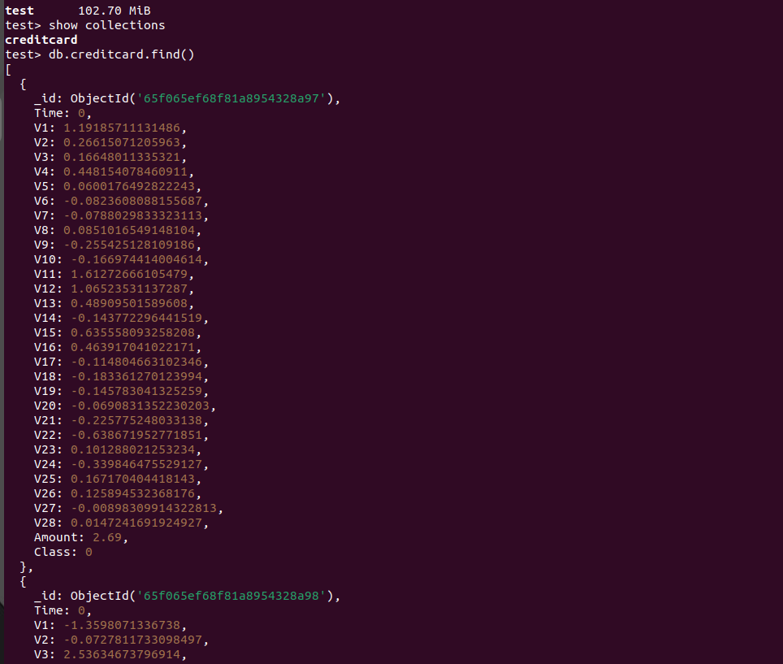
5. **Create:** попробуем теперь что-нибудь вставить в наш датасет с помощью insert. С помощью insertOne/insertMany добавляем записи подобным образом, заодно проверим, что число записей увеличилось(на атрибуты не смотрите, датасет после РСА, так что из информативных частей там только три поля)
   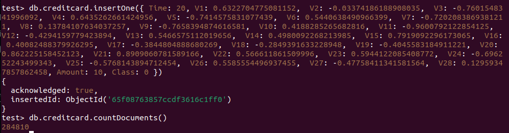
6. **Read:** Берем, что можем брать, так что давайте найдем транзакции с количеством денег <= 10
   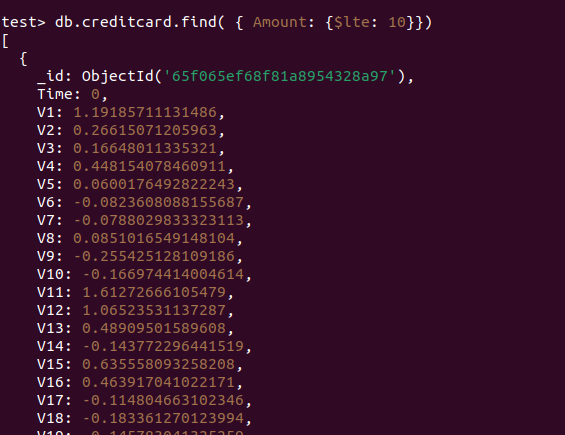
   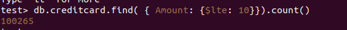
   Не то чтобы хотелось как-то анализировать полученный результат, учитывая что большая часть смысла датасета заключается в классе операции, так что просто поверим что мы умеем делать запросы(тем более в delete будет большее творчество)
7. **Update:** Коль скоро хотим update, давайте возьмем какое-то небольшое подмножество, чтобы придумать, что в нем поменять. Выбор пал на запрос к записям с временной меткой 10(обозначает сколько времени прошло с первой транзакции датасета). Нам повезло - таких записей всего 3 и все они принадлежат к классу немошеннических операций(ака 0). Давайте насолим датасету и поменяем класс у одной из них
   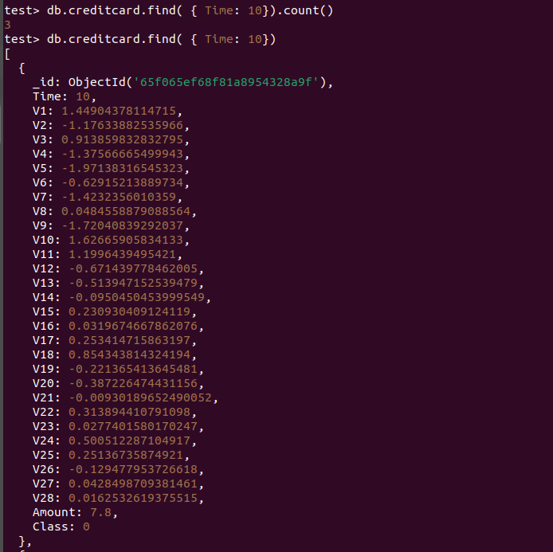
   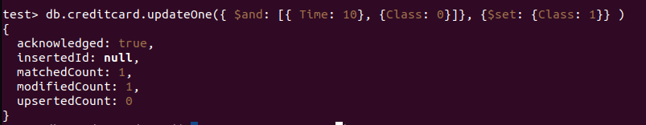
   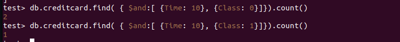
   Успешный успех!
8. **Delete:** Раз уж все равно другой информации нет, давайте эту измененную запись и удалим
   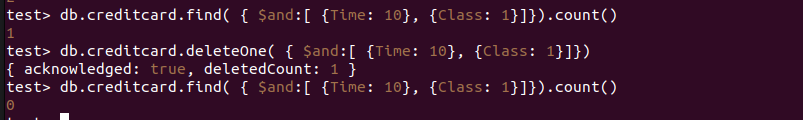
9. Внедрим в наши ряды индекс и замерим время выполнения запроса с ним и без него
   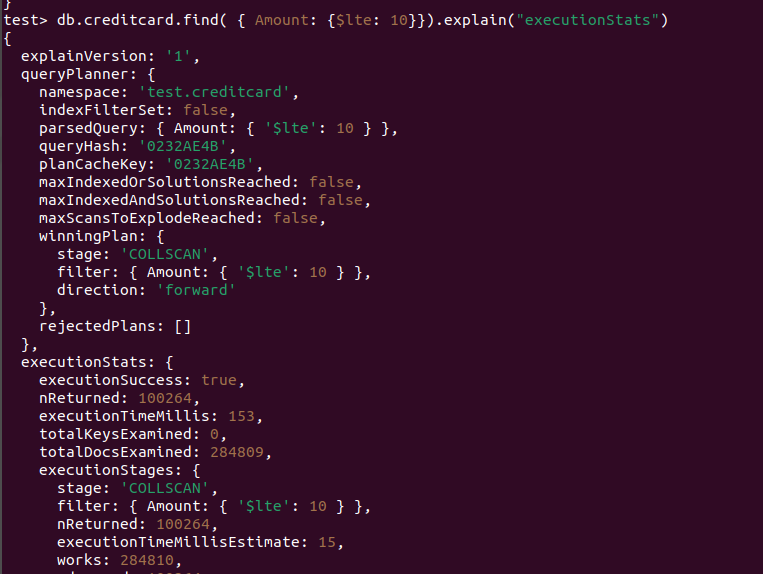
   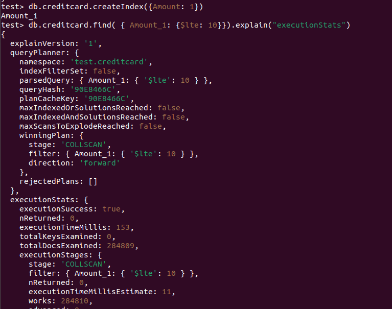
   Время уменьшилось в полтора раза, но и запрос не сильно интеллектуальный, так что возможно, что на более изощренных данных результат будет лучше

**Вывод:** Хороший инструмент, добрый, красивый
