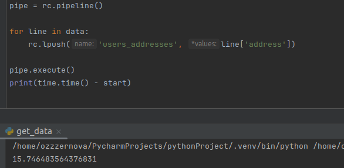

## Redis

0. Поставили Redis:

1. В качестве датасета возьмем [этот json](https://examplefile.com/code/json/20-mb-json), приступаем к самому заданию
2. Здесь и далее будут запросы через Python - код и время соответсвенно
Для начала вставим как строку - получилось примерно 4.5 секунды

Достается достаточно быстро - 5мс

3. Теперь опробуем hset - время почти не изменилось
   
   Вновь получим данные - 4мс, ускорились
   
4. Дальше на очереди zadd, но в самом датасете численных данных нет, так что выкручиваемся как можем - будем добавлять длину строк имен пользователей. Это заняло 0.6 секунд - успех!
   
   Ну и раз на то пошло запросим 11(кто вообще включает границы) кратчайших имен - опять же 6мс
   

5. Настало время lpush - повставляем адреса пользователей, получилось 13.7 секунд
   
   Получим первые 11 записей - 3мс
    
   
6. Заведем кластер - 3 ноды и 3 отходного пути
   

7. Попробуем вновь сделать запросы - записи стали медленнее, получение как будто бы не поменялось
   
   
8. Посмотрим вообще на взаимодействие нод между собой - все работает чудесно, то, что было записано в одной, отображается так же и в другой
   
9. Теперь хотим сломать одну мастер-ноду, чтобы проверить отказоустойчивость. Для этого сначала посмотрим какие ноды главные, потом остановим контейнер одной из них, и вновь проверим роли
   
   
   As we can see, подмена прошла успешно
   
**Вывод:** Ревизорро проверил отказоустойчивость, но ревизорро заметил уменьшение скорости, что в целом оправданно
