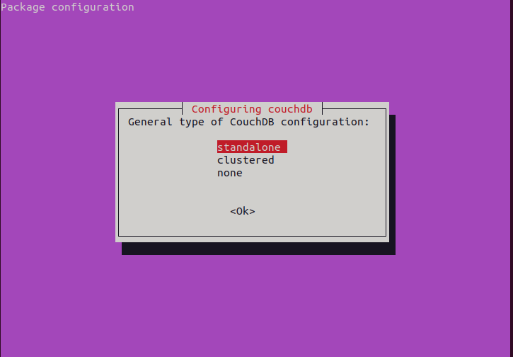
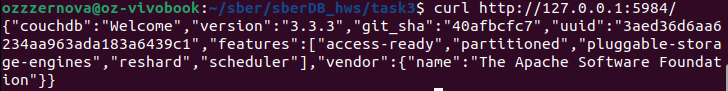
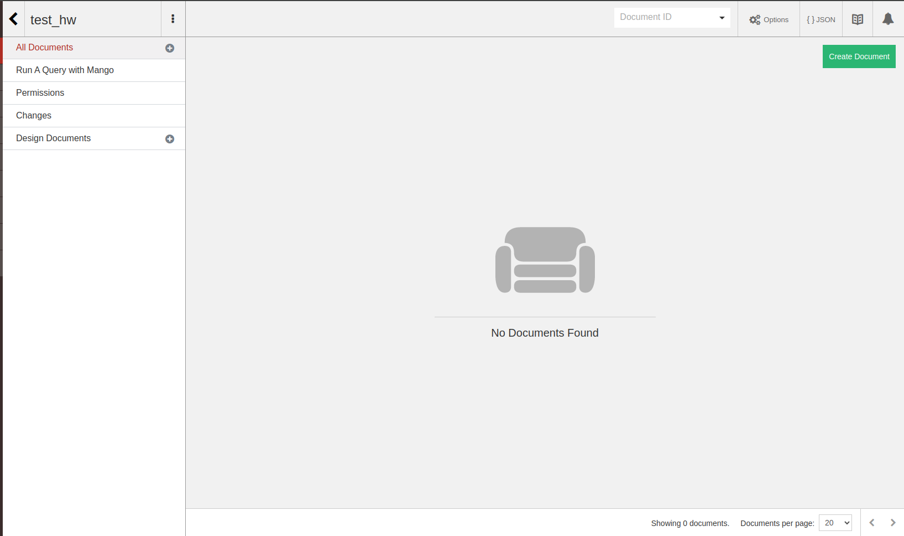
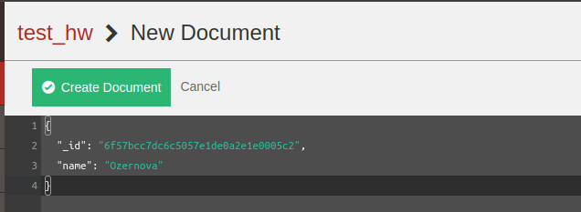
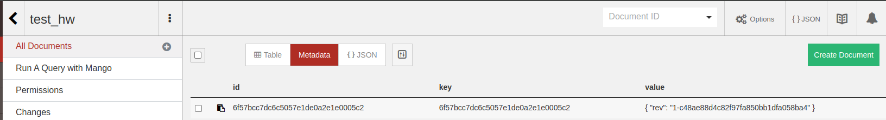
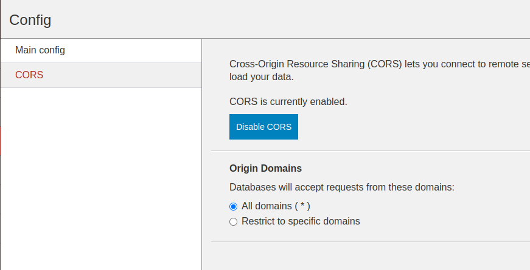
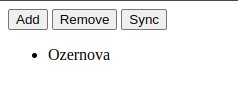
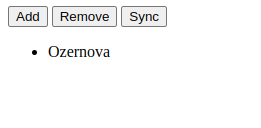

## (C/P)ouchDB

0. Поставили CouchDB и проверили что все работает:



1. В руководстве по установке был веб-интерфейс, так что не считаем, что мы чем-то хуже и отправляемся по ссылочке


2. Идем создавать документ - в шаблон добавляем поле ```name``` и заполняем фамилией


3. Смотрим, что все корректно отобразилось


4. Сначала обязательно грустим и страдаем с тем, что на нас кричит ```Access-Control-Allow-Origin```, а потом берем себя в руки и идем править CORS


5. Наконец-то успешно нажимаем на кнопку ```sync``` и смотрим на отображение фамилии. Успех!

   
6. Выходим из интерфейса(на всякий случай) и останавливаем сервис


7. Теперь проверим, что все сохранилось. Обновляем страничку, фамилия пропадает, а после нажатия на ```sync``` вновь появляется


   
**Вывод:** Занимательное, особо понравилось существование веб-версии и что не пришлось поднимать контейнер
