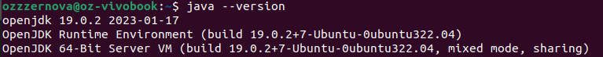
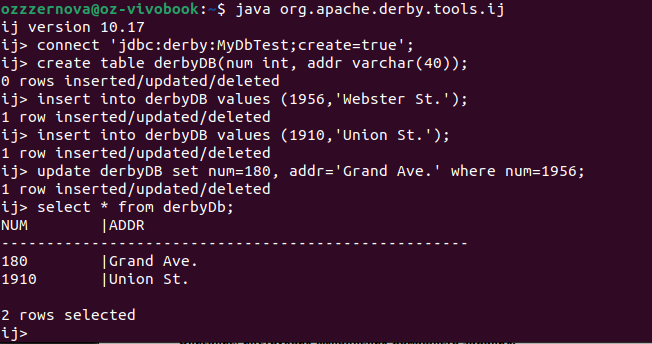

## Derby DB 

1. **Историческая сводка:** 
Apache Derby, ранее известная как [IBM Cloudscape](https://public.dhe.ibm.com/software/data/cloudscape/pubs/specsheets/cloudscape.pdf), является реляционной СУБД, распространяемой на условиях открытого исходного кода. Она написана на языке Java и может быть встроена в Java-приложения. Derby поддерживает большинство функций SQL и JDBC. Система была разработана компанией Cloudscape Inc., которая была основана в 1996 году. В 2001 году компанию Cloudscape приобрела IBM. Под названием IBM Cloudscape продукт продолжил развиваться как встроенная база данных для больших и малых приложений. В августе 2004 года IBM анонсировала намерение выпустить Cloudscape как свободное программное обеспечение под названием Apache Derby в рамках проекта Apache Incubator. После включения в проекты Apache Derby претерпела значительное количество улучшений в плане производительности, безопасности и совместимости со стандартами SQL.

2. **Инструменты для взаимодействия с СУБД**
Apache Derby как встроенная СУБД на Java предлагает ряд инструментов для взаимодействия с базой данных, позволяя разработчикам эффективно управлять данными и осуществлять запросы.

   - *ij* — это простой инструмент командной строки, который идет в комплекте с Derby. Он позволяет выполнить подключение к базе данных, выполнить SQL-запросы, и просмотреть результаты. Этот инструмент идеально подходит для быстрых испытаний или управления базой данных в режиме разработки.
   - Чтобы использовать Derby в режиме клиент-сервер, можно запустить *Derby Network Server*, который позволит подключаться к базе данных через сеть с помощью стандартного JDBC драйвера. Для Eclipse IDE есть Apache Derby Tools Plugin, с его помощью можно создавать, запускать и анализировать SQL-запросы, а также проводить базовое администрирование БД. Так же можно использовать IntelliJ IDEA от JetBrains
   - *SQuirreL SQL Client* — это графический SQL клиент, который позволяет подключаться и взаимодействовать с различными базами данных, включая Derby, через JDBC. Этот клиент предоставляет более удобный графический интерфейс для работы с базами данных.

3. Apache Derby использует свой собственный встроенный **database engine**, написанный на Java, который позволяет Derby функционировать как полноценная реляционная база данных. Этот engine носит название "Derby database engine" или иногда его называют "Derby Embedded Engine", когда он используется в встроенном режиме. Для него характерны малый размер и легкость управления, поддержка SQL и JDBC и соблюдение ACID.

4. Сначала установим Java, а потом вслед за ней и Derby с помощью [гайда](https://db.apache.org/derby/papers/DerbyTut/install_software.html#derby_configure). 




Далее будем работать с помощью **ij**, аналогично действуем согласно [руководству](https://db.apache.org/derby/papers/DerbyTut/ij_intro.html)



Сначала коннектимся(+создаем) базу данных, дальше работаем уже с ней. Как мы можем видеть, используются стандартные конструкции SQL. Здесь конкретно мы вводим их непосредственно в ij построчно, но можно сделать лучше - запускать sql-скрипты. Для демонстрации выполним следующие команды:

```
CREATE TABLE Users (
    UserId INT PRIMARY KEY,
    Username VARCHAR(255),
    Email VARCHAR(255),
    Age INT
);

INSERT INTO Users (UserId, Username, Email, Age) VALUES (1, 'Alice', 'alice@example.com', 30);
INSERT INTO Users (UserId, Username, Email, Age) VALUES (2, 'Bob', 'bob@example.com', 25);
INSERT INTO Users (UserId, Username, Email, Age) VALUES (3, 'Carol', 'carol@example.com', 27);

SELECT * FROM Users;

UPDATE Users SET Age = 31 WHERE UserId = 1;

DELETE FROM Users WHERE UserId = 3;
```


5. **Распределение по разным носителям:**
Файлы базы данных Derby могут распределяться по файловой системе. Derby поддерживает работу как с встроенной, так и с сетевой базой данных. При создании новой базы данных или подключении к существующей, вы можете указать путь, где должны храниться файлы базы данных. Это позволяет разместить файлы базы данных на определённых носителях или в конкретных директориях. В более новых версиях Derby появилась поддержка табличных пространств, которые позволяют группировать объекты базы данных (например, таблицы и индексы) в отдельных директориях. Также Derby позволяет указать каталог для таблицы при её создании через схему файловой системы, используя параметр ```DERBY_STORAGE_TABLE_DIRECTORY```. 

```
 CREATE TABLE myTable (...) TABLESPACE APP_TABLESPACE
 CREATE TABLESPACE APP_TABLESPACE IN '/example/directory'
```

6. Apache Derby написана полностью на языке программирования **Java**. Это обеспечивает высокую переносимость Derby, так как она может работать на любой платформе, поддерживающей Java. 

7. В Derby имеют место быть преимущественно два типа индексов: 

- B-tree индексы (балансированные деревья) - самый часто используемый тип индекса в Derby. B-tree индексы эффективны для операций поиска, вставки, удаления и изменения данных. Они хорошо работают для запросов, использующих операторы =, <, <=, >, >=, BETWEEN, и LIKE.

- Уникальные индексы - эти индексы обеспечивают, что в столбце или группе столбцов не может быть двух строк с одинаковыми значениями. Технически, уникальные индексы в Derby также основаны на B-tree структуре, но с дополнительным ограничением уникальности.

Пример:
``CREATE INDEX index_name ON my_table(column_name);``

8. В Apache Derby процесс выполнения SQL-запросов организован с использованием нескольких компонентов, свойственных большинству реляционных систем управления базами данных. Этот процесс включает в себя анализ запроса, оптимизацию и исполнение. Конкретно по пунктам:
- Парсинг
- Компиляция
- Оптимизация
- Генерация плана выполнения
- Исполнение

9. В Derby существует план запросов, для его просмотра можно использовать специальные утилиты или команды. Например, это можно сделать с помощью команды ```EXPLAIN```

```EXPLAIN SELECT * FROM table WHERE column = value;```

На выходе получится описание плана, которое покажет, какие операции будут выполнены, какие индексы будут использованы, как будет осуществляться доступ к данным и тд.

10. Да, Apache Derby поддерживает транзакции. В Derby транзакции следуют принципам ACID (Atomicity, Consistency, Isolation, Durability).

Управление транзакциями в Derby осуществляется с помощью SQL команд `COMMIT` и `ROLLBACK`.

- `COMMIT`: Эта команда используется для завершения текущей транзакции и фиксации всех её изменений. После выполнения `COMMIT` изменения становятся видимыми для других пользователей и операций, которые выполняются после этого.

- `ROLLBACK`: Эта команда используется для отмены всех изменений, выполненных в текущей транзакции. Это может быть полезно в случае обнаружения ошибки в процессе выполнения транзакции, позволяя "откатить" все сделанные изменения к начальному состоянию.

Также транзакции могут управляться неявно, в таком случае если не начата явная транзакция, каждая отдельная операция считается завершенной транзакцией. Это упрощает обработку операций, но может быть не таким мощным для сложных случаев последовательного изменения данных.

11. Apache Derby как встраиваемая база данных предоставляет несколько средств и методов для восстановления данных, обеспечивая долговечность и надежность системы. Основные методы восстановления в Derby включают:

- Механизм журналирования WAL - Derby использует журналирование всех изменений перед их применением в основную базу данных. Это обеспечивает возможность восстановления после сбоя, так как система может восстановить или откатить транзакции, прочитав и перепроиграв записи журнала. 
- Чекпоинты (Checkpoints) - в определённые моменты времени Derby автоматически создаёт чекпоинты. Чекпоинты фиксируют текущее состояние базы данных и сокращают время необходимое для восстановления после сбоя.
- Резервное копирование (Backup) - Derby предоставляет инструменты для создания полных и инкрементных резервных копий баз данных. Для восстановления из резервной копии администратор может заменить текущий набор данных файлами из резервной копии.

12. Шардинг в Derby
Apache Derby не включает встроенных средств для шардинга. Однако, можно организовать шардинг на уровне приложения. Например, может быть реализован шардинг по ключу, с использованием прокси или Horizontally Partitioned Derby(не является частью официального дистрибутива). HPD предлагает методы распределения данных по нескольким экземплярам Derby, возможно, работающим на разных узлах. Это расширение намерено обеспечивать поддержку горизонтального шардинга в Derby для масштабируемости, но требует дополнительной настройки и администрирования.

13. Apache Derby, как легковесная встраиваемая реляционная база данных, первоначально не предназначена для масштабных операций с большими данными, как Data Mining, Data Warehousing или OLAP (Online Analytical Processing). Однако, возможности использования Derby в данных контекстах зависят от масштаба данных и специфических требований. Давайте рассмотрим каждый термин по отдельности и возможности их применения в контексте Derby.

- Для малых проектов можно использовать Derby для базового Data Mining. Однако для более сложных задач, таких как машинное обучение или глубокий анализ, Derby может не подходить из-за ограничений производительности и масштабируемости.
- Хотя технически можно настроить Derby как склад данных для очень малых проектов, он не оптимизирован для операций, типичных для больших складов данных, таких как сложные запросы к большим объемам данных и их быстрая обработка.
- Apache Derby может поддерживать базовые OLAP-операции, такие как агрегация и срезы данных через стандартные SQL-запросы. Однако, для полноценной OLAP-функциональности потребуется использовать специализированные системы или инструменты, такие как Apache Kylin или Mondrian.

Итого, Derby подходит для достаточно ограниченных требований задач.

14. Apache Derby поддерживает несколько механизмов защиты данных:

- Шифрование базы данных - Derby позволяет шифровать целую базу данных на уровне хранения, что предотвращает доступ к данным без соответствующего ключа шифрования. Это шифрование происходит прозрачно для приложений, использующих базу данных, и поддерживается для всех форм хранения данных, включая таблицы, индексы и журналы транзакций.

```
Connection conn = DriverManager.getConnection(
    "jdbc:derby:MyEncryptedDB;create=true;dataEncryption=true;bootPassword=mySecretBootPassword");
```

- Аутентификация пользователей - Derby поддерживает несколько методов аутентификации, включая встроенную аутентификацию(управляется Derby, где учетные данные (имена пользователей и пароли) хранятся и управляются в самой базе данных) и на основе LDAP(позволяет Derby делегировать процесс аутентификации существующей внешней LDAP-службе, такой как Microsoft Active Directory или OpenLDAP)
- Авторизация - управляет тем, какие операции могут выполняться аутентифицированными пользователями. Derby предоставляет возможности для управления доступом на уровне таблиц, такие как `SELECT`, `INSERT`, `UPDATE` и `DELETE` через SQL команды `GRANT` и `REVOKE`:
``` 
GRANT SELECT ON TABLE myTable TO someUser;
REVOKE INSERT ON TABLE myTable FROM someUser;
```
- Шифрование сетевого трафика - Derby поддерживает шифрование сетевого трафика между клиентами и сервером базы данных через SSL/TLS. Это важно, когда приложения подключаются к базе данных по незащищенным сетям.

15. Apache Derby является проектом с открытым исходным кодом, который управляется и поддерживается сообществом [Apache Software Foundation](https://www.apache.org/) (ASF). ASF – это некоммерческая организация, которая поддерживает различные проекты программного обеспечения с открытым исходным кодом, в том числе Apache HTTP Server, Apache Hadoop и [Apache Derby](https://db.apache.org/derby/). Работа над Derby осуществляется волонтёрами со всего мира, которые являются частью сообщества ASF. В этом сообществе участвуют как индивидуальные разработчики, так и сотрудники различных компаний, которые используют Derby в своих проектах или заинтересованы в его поддержке и улучшении. 
Ключевыми деятелями в проектах ASF являются коммитеры (committers) и члены Проектного управляющего комитета (PMC). Коммитеры – это разработчики, которым сообщество доверило право напрямую вносить изменения в код (делать коммиты). Все изменения кода проходят через обзор других коммитеров и членов PMC, чтобы обеспечить качество и соответствие стандартам проекта.

16. Реализовано в 4 пункте о языке запросов СУБД

17. Есть [группа Facebook](https://www.facebook.com/groups/DemoDerbyDatabase/), на которой пользователи предоставляют демо-версии баз данных, которыми могут воспользоваться другие.

18. Источники информации:
- Официальная документация Apache Derby [Apache Derby Manuals](https://db.apache.org/derby/manuals/index.html): на официальном сайте Apache Derby доступна полная документация, которая включает руководства пользователя, начиная от базового введения в Derby и заканчивая продвинутыми темами, такими как производительность, безопасность и миграция данных.
- Образовательные платформы - есть курсы на Coursera и Udemy по базам данных, которые полезны для изучения основ, применимых к Derby. Также есть ряд обучающих видео на YouTube с установкой и туториалами.
- Книги -  "Beginning Apache Derby": Эта книга предоставляет полное введение в Derby, охватывая все от установки и конфигурации до продвинутых тем управления и разработки баз данных.

19. Как быть в курсе:
- Официальный сайт
- Подписка на [рассылки](https://db.apache.org/derby/derby_mail.html) Apache Derby
- Следить за [Apache Derby JIRA](https://issues.apache.org/jira/projects/DERBY/issues)
- Изменения в [репозитории](https://github.com/apache/derby)
- Конференции, встречи и блоги
